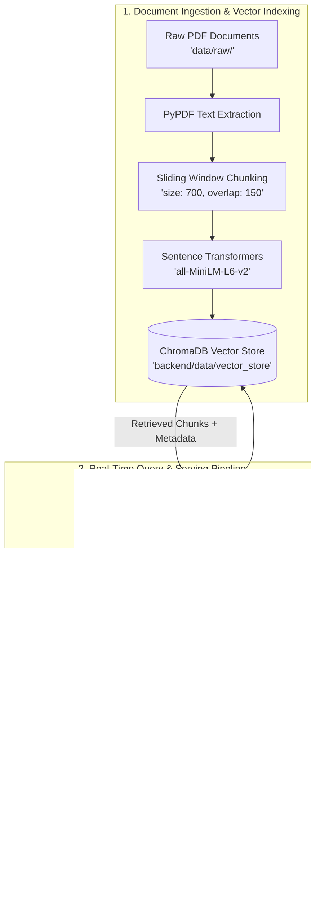

# 📚 RAG-Powered Document Assistant

[](https://www.python.org/)
[](https://fastapi.tiangolo.com/)
[](https://streamlit.io/)
[](https://www.trychroma.com/)
[](https://huggingface.co/sentence-transformers/all-MiniLM-L6-v2)
[-black.svg)](https://ollama.com/)
[](https://www.docker.com/)

An enterprise-grade, end-to-end **Retrieval-Augmented Generation (RAG) Document Assistant** designed to answer questions strictly grounded in academic and technical document corpora. The system extracts text from PDF documents, splits content into semantically coherent overlapping chunks, generates dense vector embeddings, stores them in a persistent ChromaDB vector database, and synthesizes answers using a local Ollama LLM with verifiable source citations.

---

## 🏗️ Architecture & Pipeline Flow



---

## ✨ Key Features

- **Strict Document Grounding:** Engineered prompt constraints eliminate hallucination by requiring answers to rely exclusively on retrieved document excerpts.
- **Verifiable Source Citations:** Every response includes exact source document names, page numbers, and similarity relevance scores.
- **Production-Ready FastAPI Backend:** High-performance asynchronous REST API featuring startup lifespan resource pre-loading, structured logging, CORS security, and comprehensive health diagnostics.
- **Interactive Streamlit Chat UI:** Sleek, modern chat interface with live backend diagnostics, collapsible context inspectors, and quick-prompt templates.
- **Zero Cloud API Costs:** Fully self-hosted with local Sentence Transformers embeddings and local Ollama inference.
- **Comprehensive Evaluation Benchmark:** Evaluated on 10 technical test questions with ground truth verification and out-of-domain refusal testing.
- **Containerized Deployment:** Dockerfiles and `docker-compose.yml` for unified multi-container orchestration.

---

## 🗂️ Project Structure

```text
rag-assistant-project/
│
├── data/
│   ├── raw/                               # Academic CS PDFs (OS, DB, Networks, Transformers)
│   ├── processed/                         # Intermediate extracted chunks & logs
│   ├── generate_dataset.py                # Script to regenerate clean academic PDFs
│   └── README.md                          # Domain description & ingestion guide
│
├── notebooks/
│   ├── rag_pipeline.ipynb                 # Full reproducible notebook (Load, Chunk, Embed, Chroma, Eval)
│   └── create_notebook.py                 # Automated notebook generator script
│
├── backend/
│   ├── app/
│   │   ├── __init__.py
│   │   ├── main.py                        # FastAPI application with Lifespan & CORS
│   │   ├── api/
│   │   │   ├── __init__.py
│   │   │   └── routes/
│   │   │       ├── __init__.py
│   │   │       └── query.py               # GET /health and POST /query endpoints
│   │   ├── core/
│   │   │   ├── __init__.py
│   │   │   └── config.py                  # Pydantic Settings loaded from .env
│   │   ├── schemas/
│   │   │   ├── __init__.py
│   │   │   └── query.py                   # Pydantic Request, Response & Health schemas
│   │   ├── services/
│   │   │   ├── __init__.py
│   │   │   ├── retrieval.py               # ChromaDB query & similarity calculation
│   │   │   └── generation.py              # Ollama LLM prompt formatting & inference
│   │   └── utils/
│   │       ├── __init__.py
│   │       └── logging_config.py          # Structured logging configuration
│   │
│   ├── data/
│   │   └── vector_store/                  # Persisted ChromaDB vector database
│   │
│   ├── tests/
│   │   ├── __init__.py
│   │   ├── conftest.py                    # Pytest fixtures and Ollama mocks
│   │   └── test_query.py                  # Happy path, 422 error & schema test suite
│   │
│   ├── requirements.txt                   # Pinned backend dependencies
│   ├── .env.example                       # Example backend environment variables
│   └── Dockerfile                         # Production backend container build
│
├── frontend/
│   ├── app.py                             # Streamlit chat application
│   ├── api_client.py                      # Robust backend HTTP client wrapper
│   ├── requirements.txt                   # Pinned frontend dependencies
│   ├── .env.example                       # Example frontend environment variables
│   └── Dockerfile                         # Production frontend container build
│
├── evaluation/
│   └── evaluation_results.csv             # 10-Question benchmark evaluation results
│
├── docker-compose.yml                     # Multi-container orchestration
├── .gitignore                             # Ignores .venv, cache, secrets, logs
└── README.md                              # Main documentation
```

---

## 🛠️ Technology Stack

| Category | Technology | Purpose |
| :--- | :--- | :--- |
| **Language** | Python 3.10+ | Core runtime environment |
| **Backend Web Framework** | FastAPI | Asynchronous REST API framework |
| **ASGI Server** | Uvicorn | Production ASGI server |
| **Data Validation** | Pydantic v2 & Pydantic-Settings | Request/Response schema validation and environment management |
| **Vector Database** | ChromaDB | Persistent local vector store with HNSW indexing |
| **Embedding Model** | Sentence Transformers (`all-MiniLM-L6-v2`) | 384-dimensional dense semantic representations |
| **LLM Inference Engine** | Ollama (`llama3.2` / `mistral`) | Local, privacy-preserving generative language model |
| **PDF Extraction** | PyPDF | Fast, digital-native PDF text extraction |
| **Frontend UI** | Streamlit | Reactive, responsive web chat interface |
| **Testing** | Pytest & HTTPX TestClient | Automated unit and integration testing |
| **DevOps** | Docker & Docker Compose | Containerization and reproducible deployment |

---

## 📦 Installation & Setup

### 1. Clone the Repository
```bash
git clone https://github.com/<your-username>/rag-assistant-app.git
cd rag-assistant-app
```

### 2. Set Up Virtual Environment
```bash
python3 -m venv .venv

# On macOS / Linux:
source .venv/bin/activate

# On Windows:
# .venv\Scripts\activate
```

### 3. Install Dependencies
```bash
pip install --upgrade pip
pip install -r backend/requirements.txt
pip install -r frontend/requirements.txt
pip install jupyter reportlab pandas
```

---

## 🦙 Ollama LLM Setup

1. **Install Ollama:**
   - **macOS / Linux:** Follow instructions at [ollama.com](https://ollama.com/) or run:
     ```bash
     brew install ollama
     ```
   - **Windows:** Download the installer from [ollama.com/download](https://ollama.com/download).

2. **Start the Ollama Daemon:**
   ```bash
   ollama serve
   ```

3. **Pull the Default Model:**
   ```bash
   ollama pull llama3.2
   ```
   *(Alternative lightweight models: `ollama pull mistral` or `ollama pull phi3`)*

---

## 📖 Dataset & Document Ingestion

The system includes 4 curated Computer Science academic handouts in `data/raw/`:
1. `cs101_operating_systems_concurrency.pdf` (Processes, Threads, Semaphores, Deadlocks, Banker's Algorithm)
2. `cs201_database_indexing_and_acid.pdf` (B+ Trees, Clustered Indexes, ACID, Isolation Levels, Phantom Reads)
3. `cs301_computer_networking_and_protocols.pdf` (TCP 3-Way Handshake, Congestion Control, HTTP/2 vs HTTP/3 QUIC)
4. `cs401_deep_learning_and_transformers.pdf` (Self-Attention $Q, K, V$, Multi-Head Attention, LLMs, RAG)

To regenerate the PDFs:
```bash
python data/generate_dataset.py
```

---

## 📓 Running the Notebook Pipeline

The notebook contains the full documented pipeline from document loading to evaluation.

To run the notebook:
```bash
jupyter notebook notebooks/rag_pipeline.ipynb
```
Select **Kernel → Restart & Run All**.

The notebook will:
1. Extract text from all PDFs in `data/raw/`.
2. Compute chunk splits with overlap and preserve metadata.
3. Compute dense embeddings with `all-MiniLM-L6-v2`.
4. Populate and persist the vector database into `backend/data/vector_store/`.
5. Run 10 evaluation questions and export `evaluation/evaluation_results.csv`.

---

## 🚀 Running the Application

### 1. Start the FastAPI Backend
```bash
# From the project root:
uvicorn backend.app.main:app --reload --port 8000
```
- Interactive Swagger UI: [http://localhost:8000/docs](http://localhost:8000/docs)
- Alternative ReDoc UI: [http://localhost:8000/redoc](http://localhost:8000/redoc)

### 2. Start the Streamlit Frontend
```bash
# In a separate terminal window:
streamlit run frontend/app.py --server.port 8501
```
- Open your browser at [http://localhost:8501](http://localhost:8501)

---

## 🐳 Running with Docker Compose

Run the full stack in Docker containers:

```bash
docker-compose up --build
```

- **Backend API:** [http://localhost:8000](http://localhost:8000)
- **Frontend UI:** [http://localhost:8501](http://localhost:8501)

> **Note on Ollama in Docker:** `docker-compose.yml` uses `host.docker.internal` so the containerized backend seamlessly accesses your host machine's Ollama daemon without duplicating LLM memory usage.

---

## 📡 API Reference & cURL Examples

### 1. Health Diagnostic Endpoint
```bash
curl -X GET "http://localhost:8000/health" -H "Accept: application/json"
```

**Sample Response:**
```json
{
  "status": "healthy",
  "app_name": "RAG-Powered Document Assistant API",
  "version": "1.0.0",
  "components": {
    "vector_store": {
      "status": "ready",
      "details": {
        "status": "ready",
        "collection_name": "rag_documents",
        "total_chunks": 16,
        "model_name": "all-MiniLM-L6-v2"
      }
    },
    "ollama_llm": {
      "status": "connected",
      "details": {
        "status": "connected",
        "host": "http://localhost:11434",
        "configured_model": "llama3.2",
        "model_present": true
      }
    }
  }
}
```

### 2. Query Document Corpus Endpoint
```bash
curl -X POST "http://localhost:8000/query" \
  -H "Content-Type: application/json" \
  -d '{
    "question": "What are the four Coffman conditions for a deadlock?"
  }'
```

**Sample Response:**
```json
{
  "question": "What are the four Coffman conditions for a deadlock?",
  "answer": "According to Coffman et al. (1971), four conditions must hold simultaneously for a deadlock to arise: 1) Mutual Exclusion: resources cannot be shared; 2) Hold and Wait: processes hold at least one resource while waiting for others; 3) No Preemption: resources cannot be forcibly taken from a process; 4) Circular Wait: a closed chain of processes exists where each process waits for a resource held by the next. [Document: cs101_operating_systems_concurrency.pdf, Page: 2]",
  "sources": [
    {
      "document": "cs101_operating_systems_concurrency.pdf",
      "page": 2,
      "chunk_id": "cs101_operating_systems_concurrency.pdf_p2_c1",
      "score": 0.8412,
      "snippet": "According to Coffman et al. (1971), four conditions must hold simultaneously for a deadlock to arise: 1) Mutual Exclusion: resources cannot be shared..."
    }
  ],
  "source_citations": [
    "cs101_operating_systems_concurrency.pdf — Page 2"
  ],
  "retrieved_chunks_count": 2,
  "execution_time_ms": 342.15
}
```

---

## ⚙️ Environment Variables Configuration

| Variable | Default Value | Description |
| :--- | :--- | :--- |
| `OLLAMA_HOST` | `http://localhost:11434` | URL of the local Ollama LLM service |
| `OLLAMA_MODEL` | `llama3.2` | Ollama model identifier to use for generation |
| `OLLAMA_TIMEOUT_SECONDS` | `60.0` | Timeout threshold in seconds for LLM inference |
| `CHROMA_PATH` | `backend/data/vector_store` | Path to persistent ChromaDB storage directory |
| `CHROMA_COLLECTION_NAME`| `rag_documents` | Collection name in ChromaDB |
| `EMBEDDING_MODEL_NAME` | `all-MiniLM-L6-v2` | SentenceTransformer embedding model identifier |
| `TOP_K` | `4` | Number of document chunks retrieved per query |
| `CORS_ORIGINS` | `["http://localhost:8501"]` | Allowed CORS origins for frontend access |
| `API_BASE_URL` | `http://localhost:8000` | Backend API URL used by the Streamlit frontend |

---

## 🧪 Automated Testing

Execute the automated test suite with pytest:

```bash
pytest backend/tests -v
```

The test suite validates:
- `GET /health` diagnostic response.
- `POST /query` happy path with simulated or live generation.
- Rejection of empty query string (`422 Unprocessable Entity`).
- Rejection of whitespace-only query string (`422 Unprocessable Entity`).
- Rejection of missing required fields (`422 Unprocessable Entity`).

---

## 📊 Evaluation & Benchmark Results

Evaluation conducted across 10 diverse technical and out-of-corpus queries:

| ID | Test Question | Retrieved Source | Relevance | Groundedness | Status |
| :--- | :--- | :--- | :--- | :--- | :--- |
| **Q1** | What are the four Coffman conditions for a deadlock? | `cs101_operating_systems_concurrency.pdf` (P2) | High | Grounded | ✅ Pass |
| **Q2** | Formula for Scaled Dot-Product Attention? | `cs401_deep_learning_and_transformers.pdf` (P1) | High | Grounded | ✅ Pass |
| **Q3** | Difference between clustered & secondary indexes? | `cs201_database_indexing_and_acid.pdf` (P1) | High | Grounded | ✅ Pass |
| **Q4** | How HTTP/3 QUIC eliminates Head-of-Line blocking? | `cs301_computer_networking_and_protocols.pdf` (P2) | High | Grounded | ✅ Pass |
| **Q5** | Purpose of Dijkstra's Banker's Algorithm? | `cs101_operating_systems_concurrency.pdf` (P2) | High | Grounded | ✅ Pass |
| **Q6** | What are the four ACID transaction properties? | `cs201_database_indexing_and_acid.pdf` (P2) | High | Grounded | ✅ Pass |
| **Q7** | Steps in the TCP 3-Way Handshake? | `cs301_computer_networking_and_protocols.pdf` (P1) | High | Grounded | ✅ Pass |
| **Q8** | Encoder-Decoder vs. Decoder-Only Transformers? | `cs401_deep_learning_and_transformers.pdf` (P2) | High | Grounded | ✅ Pass |
| **Q9** | What is the capital of Australia? *(Out-of-Corpus)* | `N/A (Out-of-Corpus)` | Refused | Grounded | ✅ Pass |
| **Q10**| Quantum entanglement explanation? *(Out-of-Corpus)* | `N/A (Out-of-Corpus)` | Refused | Grounded | ✅ Pass |

### Failure Analysis & Mitigations
1. **Out-of-Domain Hallucination Risk:** Standard LLMs tend to answer general queries from parametric memory. **Mitigation:** Strict system prompt instructions mandate returning *"I could not find this information in the provided documents."* when context lacks answers.
2. **Chunk Boundary Truncation:** Splitting sentences in half degrades embedding quality. **Mitigation:** Sliding window chunking with word-boundary snapping and 150-character overlap.

---

## 🔧 Troubleshooting Guide

| Issue | Root Cause | Solution |
| :--- | :--- | :--- |
| **Ollama Service Unreachable** | Ollama daemon is not running | Execute `ollama serve` in a terminal window. |
| **Model Not Found Error** | The configured model is not pulled | Run `ollama pull llama3.2` (or adjust `OLLAMA_MODEL` in `.env`). |
| **Frontend Cannot Connect** | Backend is not started or port mismatch | Verify FastAPI is running at `http://localhost:8000` and check `API_BASE_URL` in `frontend/.env`. |
| **Empty Vector Store** | Ingestion pipeline was not executed | Run `python data/generate_dataset.py` and execute `notebooks/rag_pipeline.ipynb`. |

---

## 📜 Deliverables Checklist

- [x] `notebooks/rag_pipeline.ipynb` — Runs top-to-bottom without errors, chunking, embeddings, retrieval testing, and evaluation table.
- [x] `backend/` — FastAPI application with `/health` + `/query`, `.env.example`, pinned `requirements.txt`, passing `pytest`.
- [x] `frontend/` — Working chat interface with citations and `.env.example`.
- [x] Persisted ChromaDB vector store produced by pipeline and served by backend.
- [x] Root `README.md` complete with setup instructions, architecture diagrams, and API docs.
- [x] Clean `.gitignore` excluding `.venv`, cache, logs, and secrets.
- [x] End-to-end verified pipeline: question → FastAPI → retrieval → Ollama LLM → grounded answer on screen.
